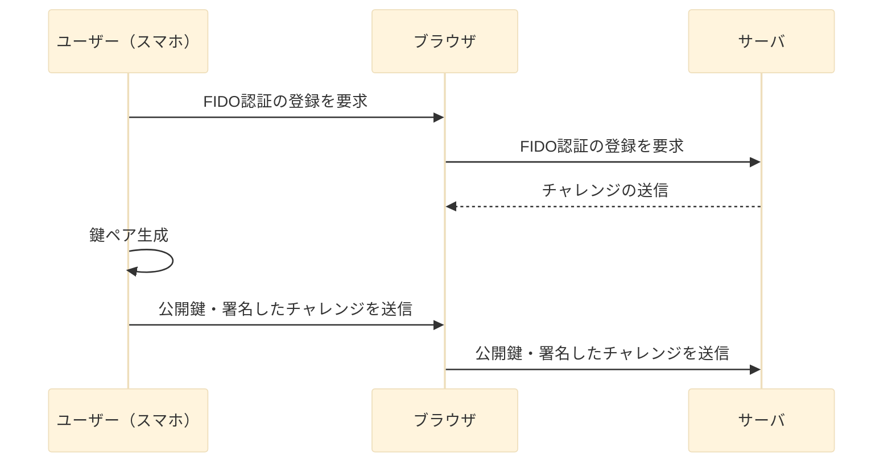
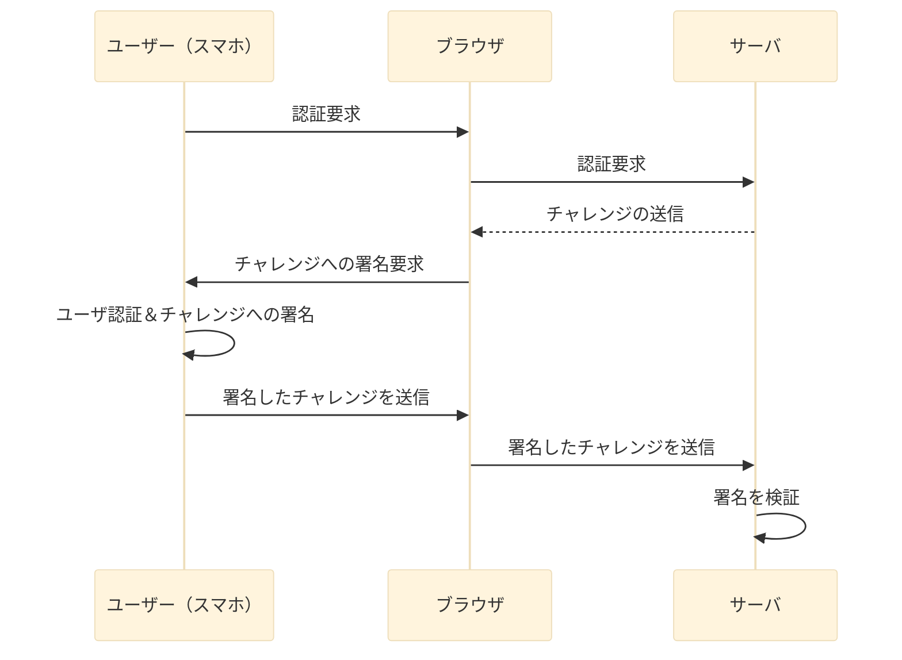

# パスキー認証

## 概要

公開鍵認証を用いて、ユーザを認証する仕組み。  
従来のベーシック認証と異なり、パスワードそのものをサーバ側に送信しないので、漏洩の可能性が格段に低くなる。  
`FIDO2`規格に則った認証方法の１つ。

### FIDO（Fast IDentity Online、 素早いオンライン認証、ファイド）

公開鍵暗号方式を基盤とした認証プロトコル。  
認証用のデバイス（スマホ等）に秘密鍵を保持し、公開鍵をサーバ側に登録する。  
認証用のデバイスのことを、「FIDO認証器」「FIDOオーセンティケータ」と呼ぶ。  

#### メリット

FIDOのメリットがそのままパスキー認証にも当てはまる。  

- サーバ側での漏洩可能性低減
- リプレイ攻撃耐性が高い  
    認証は、サーバ側から送信される`チャレンジ`（一度きりの乱数）に秘密鍵で署名することで行う。
- 認証作業が簡単  
    指紋認証、虹彩認証や、短いパスフレーズ等。  

#### FIDO認証器  

FIDO Allianceによる認定がある。セキュリティレベルや認証機の機能によって、レベル1～レベル3+まで認証機レベルが存在する。([認証機レベルについて](https://fidoalliance.org/certification/authenticator-certification-levels/?lang=ja))  
windows helloの認証機レベルは謎。FIDO2認証を受けているとのことなので、最低でもレベル１。  

> UAF、U2F、および FIDO2 の認定には、少なくとも認証器認定レベル 1（L1）の認定を受けていることが必要である。  
https://fidoalliance.org/certification/authenticator-certification-levels/authenticator-level-1-3/?lang=ja

- プラットフォーム認証器 (Platform Authenticator)  
    デバイス内蔵型。PCやスマホが該当。
- ローミング認証器 (Roaming Authenticator)  
    独立したデバイス。USBとか。

#### FIDO2

### Web Authentication（WebAuthn）

ブラウザ・サーバ間の通信の仕様。  
やり取りに必要なWEB APIなどを定義している。  
公開鍵暗号方式を用いて認証を行う。

### Client to Authenticator Protocols（CTAP）

FIDO認証器とクライアント間の通信の仕様。  
2025年7月14日時点でCTAP 2.2。  

#### 処理シーケンス

##### 登録処理

##### 認証処理

