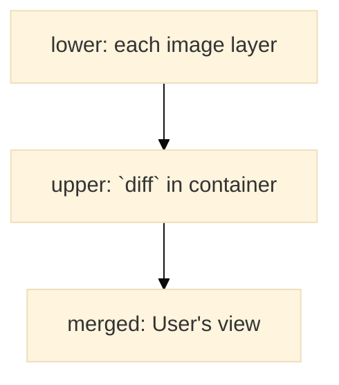
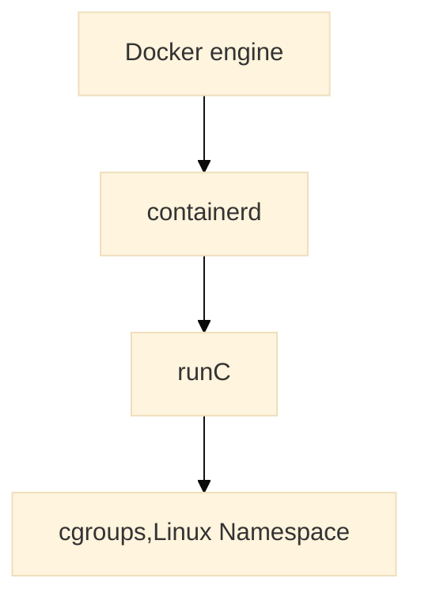

# Dockerに使用されている主要な技術


## 目次

- [`chroot`](#chroot)
- [`overlayFS`](#overlayFS)
- [`コンテナランタイム`](#コンテナランタイム)
- [`cgroups`](#cgroups)
- [`Linux Namespaces`](#linux-namespaces)


## 概要

### chroot

そのプロセスのルートディレクトリを指定する。  
その配下しか見えないようになるため、`chroot監獄`と呼ぶ（`jail`も同じ感じ？）

### overlayFS





各コンテナのファイルシステムを管理するための機能。  
2つのファイルツリー（`lower`, `upper`（Dockerでは`diff`と呼称））と、それらをmergeしたもの（`merged`）を持つ。  

それぞれ、低/高レイヤーを示しており、ユーザから見える具体的なディレクトリは`merged`である。  
ユーザが変更した内容は、`upper`に反映される。（そしてmergeされたものがユーザに見える）  
低レイヤー（`lower`）は各イメージレイヤの内容。このような仕組みにより、レイヤの再利用が可能となる。  
なお、再利用される＝同じマシン上で、複数コンテナからマウントされる ので、書き込み不可である。（新しく起動するコンテナ場合、マウントするだけで済むため、処理が速い）  

`lower`のファイルの、各コンテナでの更新方法は以下の通り。  

- 削除: `lower`に指定されているファイルを削除する場合は、`lower`から削除はできないので、[`whiteout files`](https://docs.kernel.org/filesystems/overlayfs.html#whiteouts-and-opaque-directories)として`upper`に差分が作成され、mergedする際に削除されたことを認識し、ビューに表示されないようになる。

- 更新: `upper`に`lower`の該当ファイルをコピー→編集

#### 参考資料

- [From Scratch: Primer on Linux container filesystems](https://michalpitr.substack.com/p/primer-on-linux-container-filesystems)
- [世界一わかりみが深いコンテナ & Docker入門 〜 その6:Dockerのファイルシステムってどうなってるの？ 〜](https://tech-lab.sios.jp/archives/21103)

### コンテナランタイム

`OCI Runtime Specification`(OCI仕様)に基づいたコンテナ生成・実行などを行うコンテナランタイムがあり、低レベル・高レベルで分かれている。  
`containerd`でコンテナの状態管理、`runC`で実際のコンテナの作成削除等の処理を行う。  




Docker互換のCLI（[`nerdctl`](https://github.com/containerd/nerdctl)）が、`containerd`のサブプロジェクトにある。（現状、tarを落として手動インストールが必要）  
> nerdctl: Docker-compatible CLI for containerd

`nerdctl run`, `nerdctl compose up` 等、UIは同じ。  

`nerdctl`特有の機能が２点。  

- `lazy-pulling`: pullし終える前にコンテナを起動する機能
- `encryption of images`: イメージレイヤを暗号・復号化する機能

`nerdctl`に切り替えた場合、containerdで完結することになる。（Docker不要）  
k8sのランタイムではdocker非推奨だそうで、`nerdctl`が視野に入る？  
Dockerとの関係では、`containerd`の最新機能をいち早く取り入れて実験可能にするのが`nerdctl`の役割ということで、対抗馬ではないということになっている。  
現状はk8sの時は使う、それ以外ならひとまずDockerで良さそう。（今使っているものを継続利用）  

#### 参考資料

- [github: `nerdctl`](https://github.com/containerd/nerdctl)

## cgroups

cgroupsv1はそろそろ非推奨の流れなので、cgroupsv2について。  
プロセスが消費するリソースの制限を行う機能。  

### コントローラ

`cpu`, `memory` など、各リソースの制限を行うもの。  
`cpu.max`ファイルに書き込んだ数値がCPU利用時間の上限、といった具合。  
`cgroup.procs`: そのcgroupに属するプロセスID一覧。つまり、ここにPIDを書き込むと、そのプロセスはそのcgroupに属することになる。  

#### 簡単に実行してみる

1. cgroupを作成  

    必要なコントローラファイルは自動で作成される。  

    ```
    root@study:~# mkdir /sys/fs/cgroup/stress
    root@study:~# ls /sys/fs/cgroup/stress/
    cgroup.controllers               io.max
    cgroup.events                    io.pressure
    cgroup.freeze                    io.prio.class
    cgroup.kill                      io.stat
    cgroup.max.depth                 io.weight
    cgroup.max.descendants           memory.current
    cgroup.pressure                  memory.events
    cgroup.procs                     memory.events.local
    cgroup.stat                      memory.high
    cgroup.subtree_control           memory.low
    cgroup.threads                   memory.max
    cgroup.type                      memory.min
    cpu.idle                         memory.numa_stat
    cpu.max                          memory.oom.group
    cpu.max.burst                    memory.peak
    cpu.pressure                     memory.pressure
    cpuset.cpus                      memory.reclaim
    cpuset.cpus.effective            memory.stat
    cpuset.cpus.exclusive            memory.swap.current
    cpuset.cpus.exclusive.effective  memory.swap.events
    cpuset.cpus.partition            memory.swap.high
    cpuset.mems                      memory.swap.max
    cpuset.mems.effective            memory.swap.peak
    cpu.stat                         memory.zswap.current
    cpu.stat.local                   memory.zswap.max
    cpu.uclamp.max                   memory.zswap.writeback
    cpu.uclamp.min                   misc.current
    cpu.weight                       misc.events
    cpu.weight.nice                  misc.max
    hugetlb.2MB.current              pids.current
    hugetlb.2MB.events               pids.events
    hugetlb.2MB.events.local         pids.max
    hugetlb.2MB.max                  pids.peak
    hugetlb.2MB.numa_stat            rdma.current
    hugetlb.2MB.rsvd.current         rdma.max
    hugetlb.2MB.rsvd.max
    ```

1. CPU利用率を確認

    ```
    procs -----------memory---------- ---swap-- -----io---- -system-- -------cpu-------
    r  b   swpd   free   buff  cache   si   so    bi    bo   in   cs us sy id wa st gu
    1  0      0 268940  86844 1418480    0    0    43    86   43    0  0  0 100  0  0  0
    ```

1. 1コア丸々利用している状態にする

    ```
    root@study:~# nohup yes>/dev/null &
    [1] 3712
    root@study:~# nohup: ignoring input and redirecting stderr to stdout
            PID USER      PR  NI    VIRT    RES    SHR S  %CPU  %MEM     TIME+ COMMAND                     
    3712 root      20   0    5684   1920   1920 R  99.7   0.1   1:39.57 yes                         
    2482 root      20   0 1233580  11128   7424 S   0.3   0.6   0:01.54 containerd-shim             
    3719 root      20   0   11920   5888   3712 R   0.3   0.3   0:00.02 top                         
        1 root      20   0   22672  13552   9328 S   0.0   0.7   0:01.31 systemd                     
        2 root      20   0       0      0      0 S   0.0   0.0   0:00.00 kthreadd    
    ```

1. プロセスをcgroupに所属させ、CPU利用率上限を設定する  

    `cpu.max`の設定は`10000/100000`（10%）。この母数は固定らしい。  
    例えば２コアに制限したい場合は`200000/100000`と書く。  

    ```
    # PID: 3712をstressグループに追加
    root@study:~# echo 3712 >> /sys/fs/cgroup/stress/cgroup.procs
    root@study:~# cat /sys/fs/cgroup/stress/cgroup.procs 
    3712
    # CPU使用率上限を設定
    root@study:~# echo "10000 100000" > /sys/fs/cgroup/stress/cpu.max
    # CPU使用率が10%になっている
    PID USER      PR  NI    VIRT    RES    SHR S  %CPU  %MEM     TIME+ COMMAND
    3712 root      20   0    5684   1920   1920 R  10.0   0.1   4:22.30 yes 
    # プロセスを削除してみる
    root@study:~# kill 3712
    # ファイルを見ると、Terminatedと記載されている
    root@study:~# cat /sys/fs/cgroup/stress/cgroup.procs 
    [1]+  Terminated              nohup yes > /dev/null
    ```

### v1とv2の違い

ざっくりと。

- v1のディレクトリ構造
    - ディレクトリ構造: `/sys/fs/cgroup/<controller>/<cgroup>`

- v2(Unified と呼ばれる通り、各cgroupにコントローラがフラットに置かれる)
    - ディレクトリ構造: `/sys/fs/cgroup/<cgroup>/<controller>`
    - `cgroup.controllers`: 利用可能なコントローラ一覧
    - `cgroup.subtree_control`: 有効なコントローラ一覧
        - `echo '+pids -memory' > /sys/fs/cgroup/<cgroup>/cgroup.subtree_control` のように有効化・無効化する

## Linux Namespaces

リソース自体分離する機能。  
例えば、ファイルシステムで言うと、ホスト上にファイルシステムをマウントすると、そこで作成したファイルはどのプロセスからも見える。  
これを特定のプロセスからしか見えないファイルシステムにする機能。  
`unshare`コマンドで利用可能。（`unshare <program>`）  

- ファイルシステム  
    ファイルシステムを分離する。ほかのプロセスからは見えなくなる。
- pids  
    pidを分離する。そのプロセスのPIDは、ホスト側では通常通り振られるが、Namespace内では、必ず1になる。 

### やってみる

現在のNamespaceでのプロセスを確認  

```
root@study:~# ps -ef
UID          PID    PPID  C STIME TTY          TIME CMD
root           1       0  0 14:24 ?        00:00:00 /sbin/init
root           2       0  0 14:24 ?        00:00:00 [kthreadd]
root           3       2  0 14:24 ?        00:00:00 [pool_workqueue_release]
root           4       2  0 14:24 ?        00:00:00 [kworker/R-rcu_g]
root           5       2  0 14:24 ?        00:00:00 [kworker/R-rcu_p]
root           6       2  0 14:24 ?        00:00:00 [kworker/R-slub_]
root           7       2  0 14:24 ?        00:00:00 [kworker/R-netns]
root           8       2  1 14:24 ?        00:00:02 [kworker/0:0-events]
root           9       2  0 14:24 ?        00:00:01 [kworker/0:1-cgroup_destroy]
~~~~~~~~~~~~~~~~~~~~~~~~~~~~~~~~~~~~~~~~~~~~~~~~~~~~~~~~~~~~~~~~~~~~~~~~~~~~~~~~~~~~
root        1282    1281  0 14:25 pts/1    00:00:00 -bash
root        1308    1282  0 14:28 pts/1    00:00:00 ps -ef
```

`unshare`するも、メモリが割り当てられないとのこと。  

```
# unshare --pid bash
fork: Cannot allocate memory
```

https://stackoverflow.com/a/45973522を読むと、上記コマンドだと、`bash`自体は新規に作成されるNamespaceに所属せず、`bash`のサブプロセス（フォークされる）が所属するらしい。  
つまり、そのサブプロセスが新しいNamespaceのPID1になる。しかし、そのサブプロセスは起動処理後に終了するため、PID1が不在となり上記エラーになるらしい。  

したがって、`bash`自体をNamespaceに入れる必要があり、それは指定したプログラムを`fork`するよう指定すれば良いらしい。  
が、エラー。  
`/proc`ファイルシステムが、Namespace隔離前のままだとダメらしい。つまりほかのNamespaceのプロセスが見える状態なのでNG？  
`/proc`をマウントしなおすと、自Namespaceのプロセスのみ見えるようになった。  

```
root@study:~# unshare --pid --fork bash
root@study:~# ps -ef
fatal library error, lookup self
root@study:~# mount -t proc proc /proc
root@study:~# ps -ef
UID          PID    PPID  C STIME TTY          TIME CMD
root           1       0  0 14:36 pts/1    00:00:00 bash
root          12       1  0 14:38 pts/1    00:00:00 ps -ef
root@study:~# ls /proc/
```

`exit`後にもう一度試したら、内容が変わった。  
親切に、やり方を教えてくれる。  

```
root@study:~# ls /proc/
ls: cannot read symbolic link '/proc/self': No such file or directory
ls: cannot read symbolic link '/proc/thread-self': No such file or directory
acpi        dma            kallsyms       mdstat        scsi           tty
bootconfig  driver         kcore          meminfo       self           uptime
buddyinfo   dynamic_debug  keys           misc          slabinfo       version
bus         execdomains    key-users      modules       softirqs       version_signature
cgroups     fb             kmsg           mounts        stat           vmallocinfo
cmdline     filesystems    kpagecgroup    mtrr          swaps          vmstat
consoles    fs             kpagecount     net           sys            zoneinfo
cpuinfo     interrupts     kpageflags     pagetypeinfo  sysrq-trigger
crypto      iomem          latency_stats  partitions    sysvipc
devices     ioports        loadavg        pressure      thread-self
diskstats   irq            locks          schedstat     timer_list
root@study:~# ps -ef
Error, do this: mount -t proc proc /proc
```

このマウントはオプション（`--mount-proc`）でも可能。

```
root@study:~# unshare --pid --fork --mount-proc bash
root@study:~# ps -ef
UID          PID    PPID  C STIME TTY          TIME CMD
root           1       0  0 14:28 pts/1    00:00:00 bash
root           8       1  0 14:28 pts/1    00:00:00 ps -ef
```

## 参考

- コンテナを実装してみている例  
    以下を参考に、ミニDocker再開発をしてみると良いかも。  
    - [`Linux container from scratch`](https://michalpitr.substack.com/p/linux-container-from-scratch?triedRedirect=true)
    - https://qiita.com/PND/items/d2dfb0ef0568a6e81b3e